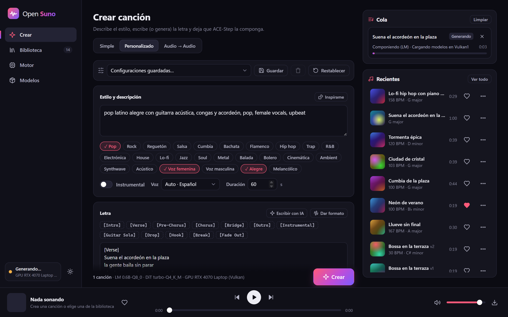
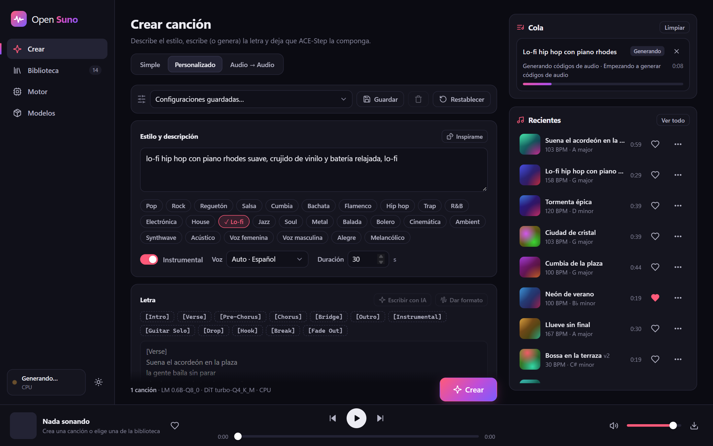
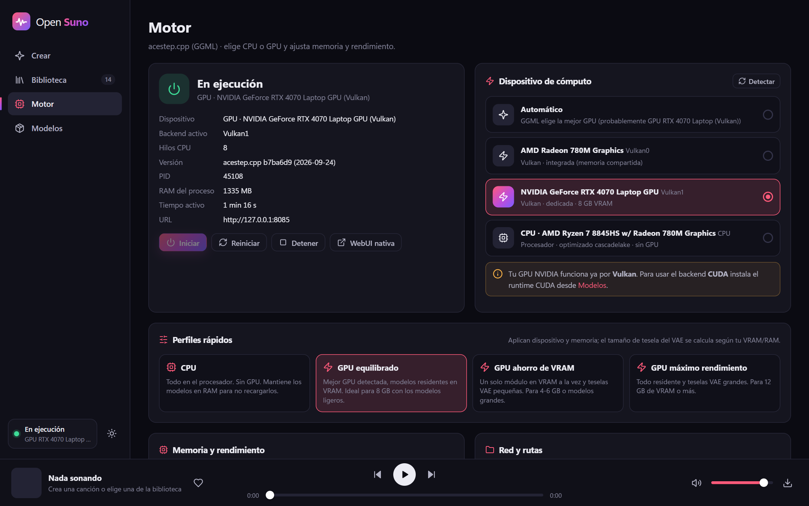
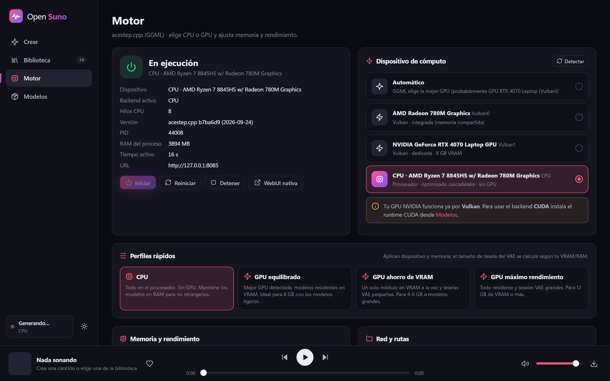
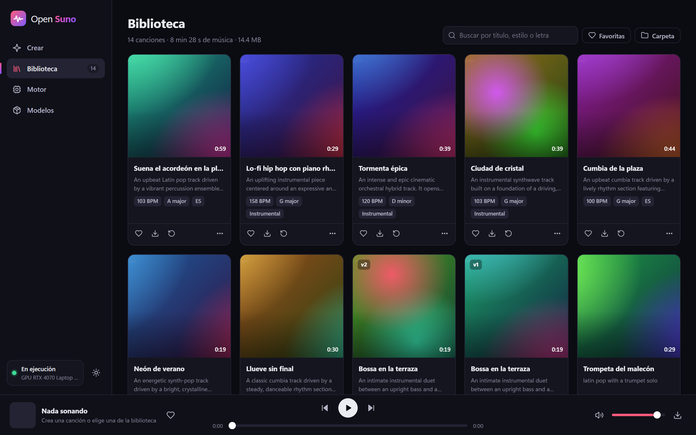
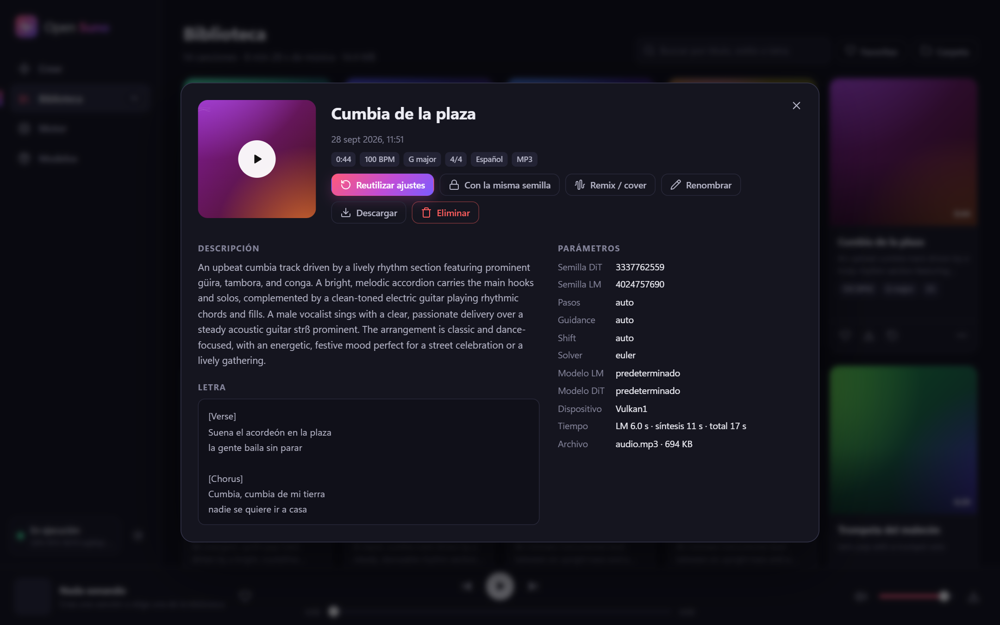
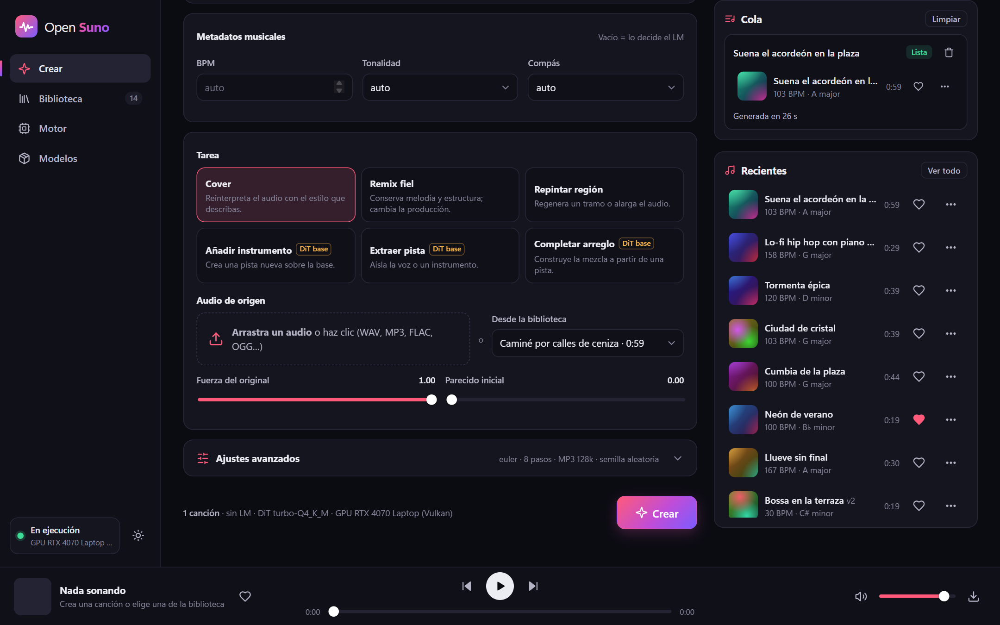
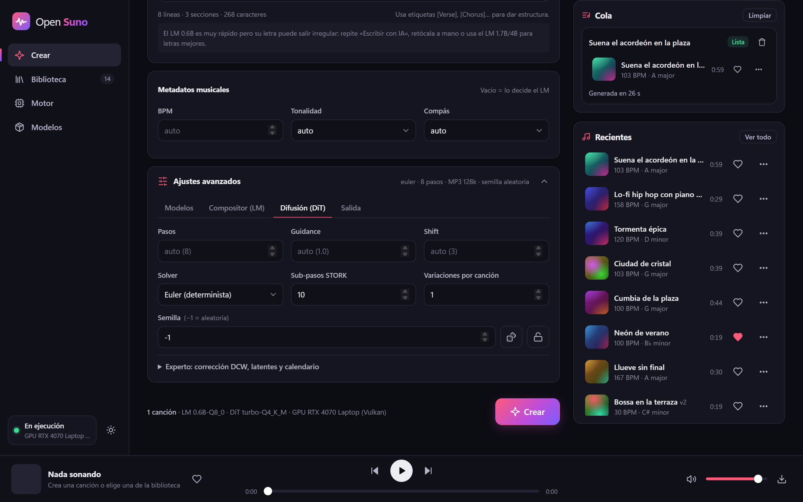
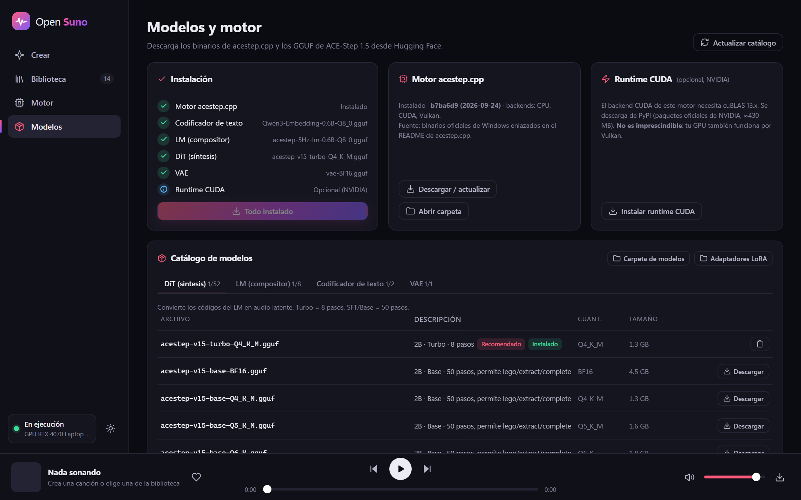
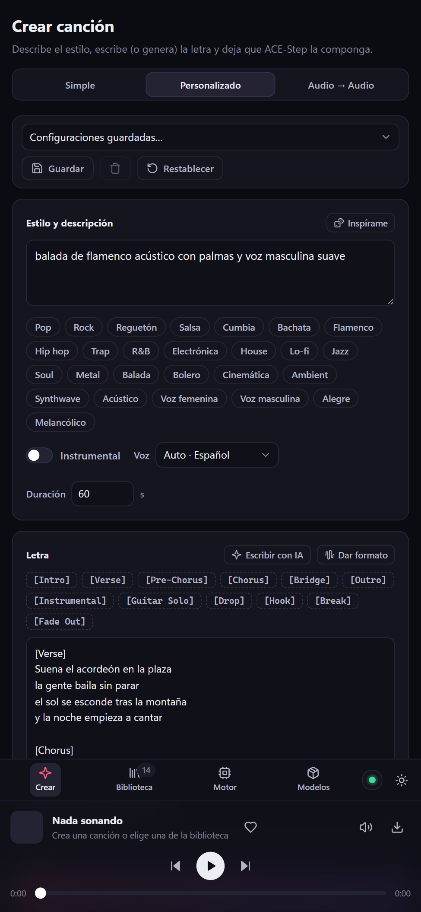

<div align="center">

# 🎵 Open Suno

**Crea canciones con IA en tu propio ordenador, con CPU o con GPU.**

Aplicación web local basada en [ACE-Step 1.5](https://github.com/ace-step/ACE-Step-1.5) y el motor
C++/GGML [acestep.cpp](https://github.com/ServeurpersoCom/acestep.cpp).
Sin cuentas, sin nube: la música se genera y se guarda en tu equipo.




</div>

## Índice

- [Qué hace](#qué-hace)
- [Capturas](#capturas)
- [Requisitos](#requisitos)
- [Instalación paso a paso (Windows)](#instalación-paso-a-paso-windows)
- [Instalación en Linux y macOS](#instalación-en-linux-y-macos)
- [Qué se descarga durante la instalación](#qué-se-descarga-durante-la-instalación)
- [Elegir CPU o GPU](#elegir-cpu-o-gpu)
- [Cómo se usa](#cómo-se-usa)
- [Rendimiento de referencia](#rendimiento-de-referencia)
- [Opciones avanzadas](#opciones-avanzadas)
- [Solución de problemas](#solución-de-problemas)
- [Estructura del proyecto](#estructura-del-proyecto)
- [Créditos y licencias](#créditos-y-licencias)

## Qué hace

- **Texto → canción**: describe el estilo y el LM de ACE-Step escribe la letra, elige tempo, tonalidad y
  duración, y el modelo de difusión genera el audio estéreo a 48 kHz.
- **Tres modos de creación**
  - *Simple*: sólo una descripción.
  - *Personalizado*: tu propia letra con etiquetas `[Verse]`, `[Chorus]`…, BPM, tonalidad, compás, idioma
    y duración. Botones «Escribir con IA» y «Dar formato» para que el LM escriba u ordene la letra.
  - *Audio → Audio*: cover, remix fiel, repintar o alargar un tramo y, con un DiT *base*, añadir
    instrumento, extraer pista o completar un arreglo. El audio de origen puede ser un archivo o una canción
    de tu biblioteca.
- **Todo configurable**: modelos, LoRA, referencia de timbre, temperatura/CFG/top-p/top-k del LM, pasos,
  guidance, shift, solver (Euler, SDE, DPM++ 3M, STORK 4), semilla, variaciones, formato MP3/WAV…
  y **configuraciones guardadas** con nombre.
- **CPU o GPU**: detecta qué dispositivos puede usar el motor (CPU, NVIDIA por CUDA o Vulkan, AMD/Intel por
  Vulkan) y trae perfiles que ajustan la memoria a tu hardware.
- **Biblioteca** con reproductor, favoritas, búsqueda, descarga y «reutilizar ajustes / misma semilla».
- **Instalación automática**: el repositorio sólo contiene la app; el motor y los modelos (~3,5 GB) se
  descargan solos al instalar, con reanudación y verificación SHA-256.

## Capturas

| Crear en **GPU** (RTX 4070 por Vulkan) | Crear en **CPU** (Ryzen 7) |
|---|---|
|  |  |
| **Motor en GPU** | **Motor en CPU** |
|  |  |
| **Biblioteca** | **Detalle de una canción** |
|  |  |
| **Audio → Audio** (cover, remix, repintar…) | **Ajustes avanzados** |
|  |  |
| **Modelos e instalación** | **Móvil** |
|  |  |

## Requisitos

| | Mínimo | Recomendado |
|---|---|---|
| Sistema | Windows 10/11 x64 · Linux x64 · macOS (Apple Silicon) | Windows 11 |
| Python | 3.10 | 3.12 |
| RAM | 8 GB | 16 GB o más |
| Disco | 5 GB libres | 10 GB (para probar otros modelos) |
| GPU (opcional) | Cualquier GPU con Vulkan y 4 GB de VRAM | NVIDIA con 8 GB o más |
| Internet | Sólo durante la instalación | |

Sin GPU funciona igual, sólo más despacio (ver [rendimiento](#rendimiento-de-referencia)).

## Instalación paso a paso (Windows)

**1. Instala Python 3.10 o superior**

Descárgalo de [python.org/downloads](https://www.python.org/downloads/). En la primera pantalla del
instalador **marca «Add python.exe to PATH»**.

**2. Descarga Open Suno**

- Opción A: pulsa **Code → Download ZIP** en esta página y descomprímelo, por ejemplo en `C:\OpenSuno`.
- Opción B, con Git:

  ```bash
  git clone https://github.com/jceronch1/open_suno.git
  ```

**3. Ejecuta `install.bat`** (doble clic)

El instalador lo hace todo solo:

1. Crea un entorno de Python aislado (`.venv`) e instala las dependencias.
2. Descarga el motor **acestep.cpp** para Windows (≈170 MB, incluye CPU, CUDA y Vulkan).
3. Descarga los **4 modelos** de ACE-Step 1.5 (≈3,3 GB) y comprueba su SHA-256.
4. Si tienes GPU NVIDIA, ofrece el runtime CUDA (≈430 MB, recomendado para canciones largas). Si dices
   que no, la GPU se usa igualmente por Vulkan.
5. Detecta tu CPU/GPU y deja configurado el mejor perfil.

Verás algo así:

```text
=== Open Suno · instalación ===

[1/4] Motor acestep.cpp
  [OK] Motor acestep.cpp (CPU + CUDA + Vulkan)
[2/4] Modelos ACE-Step 1.5
  4 modelo(s) por descargar, 3.1 GB en total (Hugging Face: Serveurperso/ACE-Step-1.5-GGUF)
  · acestep-v15-turbo-Q4_K_M.gguf (1.3 GB)
  [##########################] 100.0%  1.3 GB / 1.3 GB Verificando …
  [OK] acestep-v15-turbo-Q4_K_M.gguf
  ...
[3/4] Runtime CUDA (opcional)
  [OK] Runtime CUDA 13 (cuBLAS)
[4/4] Configuración CPU/GPU
    - CUDA0     NVIDIA GeForce RTX 4070 Laptop GPU · 8 GB
    - Vulkan0   NVIDIA GeForce RTX 4070 Laptop GPU · 8 GB
    - Vulkan1   AMD Radeon 780M Graphics (integrada)
    - CPU       AMD Ryzen 7 8845HS w/ Radeon 780M Graphics
  [OK] Perfil «GPU equilibrado»: dispositivo CUDA0, VAE chunk 320

Listo. Arranca Open Suno con start.bat y abre http://127.0.0.1:7870
```

Si se corta la conexión, vuelve a ejecutar `install.bat`: las descargas continúan donde se quedaron.

**4. Ejecuta `start.bat`** (doble clic)

Se abre el navegador en **http://127.0.0.1:7870**. Deja la ventana negra abierta mientras uses la app;
al cerrarla se detienen Open Suno y el motor.

**5. Crea tu primera canción**

En **Crear**, escribe una descripción (por ejemplo *«pop latino alegre con guitarra acústica y voz
femenina»*), pulsa las etiquetas de estilo que quieras y pulsa **Crear**. La canción aparece en la cola y,
al terminar, en **Recientes** y en la **Biblioteca**.

> **Actualizar Open Suno:** descarga la nueva versión encima de la carpeta (o `git pull`) y ejecuta
> `install.bat` otra vez; tus canciones y ajustes (carpeta `data/`) se conservan.

## Instalación en Linux y macOS

No hay binarios precompilados del motor para estas plataformas, así que el instalador **descarga el código
de acestep.cpp y lo compila** automáticamente.

1. Instala los requisitos:
   - Debian/Ubuntu: `sudo apt install python3 python3-venv git cmake build-essential libopenblas-dev`
   - macOS: `xcode-select --install` y `brew install python cmake`
   - GPU NVIDIA: [CUDA Toolkit](https://developer.nvidia.com/cuda-downloads) · GPU AMD/Intel: [Vulkan SDK](https://vulkan.lunarg.com/sdk/home)
     (en macOS se usa Metal automáticamente)
2. Descarga Open Suno e instala:

   ```bash
   git clone https://github.com/jceronch1/open_suno.git
   cd open_suno
   ./install.sh
   ```

3. Arranca con `./start.sh` y abre http://127.0.0.1:7870.

## Qué se descarga durante la instalación

El repositorio **sólo contiene la aplicación** (unos pocos cientos de KB de código y estas capturas).
Todo lo pesado se descarga de sus fuentes oficiales al instalar:

| Qué | Tamaño | De dónde |
|---|---|---|
| Dependencias de Python (FastAPI, Uvicorn, httpx, psutil) | ~15 MB | PyPI |
| Motor acestep.cpp para Windows (CPU + CUDA + Vulkan) | ~170 MB | Binarios enlazados en el [README de acestep.cpp](https://github.com/ServeurpersoCom/acestep.cpp#windows) |
| Código de acestep.cpp (Linux/macOS, o si falla lo anterior) | ~50 MB | [GitHub](https://github.com/ServeurpersoCom/acestep.cpp) |
| `acestep-v15-turbo-Q4_K_M.gguf` · DiT ACE-Step 1.5 Turbo 2B | 1,45 GB | [Hugging Face](https://huggingface.co/Serveurperso/ACE-Step-1.5-GGUF) |
| `acestep-5Hz-lm-0.6B-Q8_0.gguf` · LM compositor | 710 MB | Hugging Face |
| `Qwen3-Embedding-0.6B-Q8_0.gguf` · codificador de texto | 784 MB | Hugging Face |
| `vae-BF16.gguf` · VAE | 337 MB | Hugging Face |
| Runtime CUDA 13 (opcional, sólo NVIDIA) | ~430 MB | Paquetes oficiales de NVIDIA en PyPI |

Más modelos (LM 1.7B/4B, DiT SFT/Base/XL…) se descargan desde la pestaña **Modelos** de la app.

## Elegir CPU o GPU

En la sección **Motor** eliges el dispositivo exacto que usará el motor, o aplicas un perfil rápido:

| Perfil | Dispositivo | Modelos en memoria | Tesela del VAE |
|---|---|---|---|
| **CPU** | Procesador | Sí (RAM) | Según tu RAM (máx. 1024) |
| **GPU equilibrado** | Mejor GPU (CUDA > Vulkan dedicada) | Sí | Calculada con tu VRAM |
| **GPU ahorro de VRAM** | Mejor GPU | Uno a la vez | Calculada, máx. 512 |
| **GPU máximo rendimiento** | Mejor GPU | Sí | Calculada, máx. 2048 |

Detalles útiles:

- Open Suno pregunta al propio motor qué dispositivos ve, así que en portátiles con **gráfica integrada +
  dedicada** puedes elegir la dedicada (la integrada suele aparecer primero como `Vulkan0`).
- El VAE del motor gasta unos 9 MB de memoria por *frame* latente de cada tesela: por eso el tamaño de
  tesela («VAE chunk») decide si una GPU de 8 GB se queda sin memoria. Los perfiles lo calculan solos.
- **NVIDIA:** funciona desde el primer momento por **Vulkan**. Para el backend **CUDA** instala el runtime
  opcional (`install.bat --cuda` o **Modelos → Instalar runtime CUDA**) y elige `CUDA0` en **Motor**.
  CUDA no es más rápido en canciones cortas, pero en GPUs de 8 GB evita los atascos por falta de VRAM en
  canciones largas (ver [rendimiento](#rendimiento-de-referencia)).
- Si instalas CUDA o actualizas el motor puede cambiar la numeración de las GPU (`Vulkan0`, `Vulkan1`…).
  Open Suno guarda el nombre de tu GPU y vuelve a seleccionar la misma automáticamente.

## Cómo se usa

- **Crear** · escribe la descripción, activa/desactiva etiquetas de estilo (un clic añade el estilo y otro
  lo quita), elige *Instrumental* o escribe la letra y pulsa **Crear** (o `Ctrl+Enter`). En *Ajustes
  avanzados* puedes pedir varias variaciones, fijar la semilla o cambiar de modelo.
- **Biblioteca** · reproduce, busca, marca favoritas y descarga. Desde el menú `···` de cada canción:
  reutilizar ajustes, reproducirla con la misma semilla, hacer un cover o repintar un tramo, usarla como
  referencia de timbre, renombrar o eliminar.
- **Motor** · estado de acestep.cpp, dispositivo, perfiles, memoria, monitor de hardware y registro en vivo.
- **Modelos** · estado de la instalación, actualización del motor, runtime CUDA y catálogo completo de GGUF.

Consejo: el LM de 0.6B es muy rápido pero a veces escribe letras irregulares. Repite «Escribir con IA»,
retoca la letra o descarga el LM 1.7B/4B en **Modelos**.

## Rendimiento de referencia

Medido en un portátil **Ryzen 7 8845HS + RTX 4070 Laptop (8 GB)** con los modelos por defecto, la misma
letra, los mismos metadatos y la misma semilla. Tiempo total por canción, con los modelos ya cargados
(las cifras de 3 y 4 min son la media de 3 repeticiones):

| Duración de la canción | GPU Vulkan · equilibrado | GPU CUDA · equilibrado | GPU Vulkan · ahorro de VRAM | CPU (8 hilos) |
|---|---|---|---|---|
| 30 s | 5,5 s | 5,9 s | — | ~69 s |
| 1 min | 7,6 s | 8,7 s | — | — |
| 2 min | 14,6 s | 17,2 s | — | — |
| 3 min | **21,6 s** | 24,9 s | 26,4 s | — |
| 4 min | 111 s ⚠️ | **34,8 s** | **33,4 s** | — |

- Primera canción tras arrancar el motor (carga de modelos incluida, 30 s): 12,5 s en Vulkan y 10,9 s en CUDA.
- **CUDA no acelera las canciones cortas** (el compositor LM va algo más lento que en Vulkan), pero con 8 GB
  de VRAM evita que las canciones de 4 min se atasquen: en Vulkan, con todos los modelos cargados, la
  difusión se queda sin VRAM y pasa de 3 s a 85 s.
- Para canciones de 3-4 min en una GPU NVIDIA de 8 GB, lo más equilibrado es **CUDA** (o Vulkan con el
  perfil «ahorro de VRAM»). Con más VRAM la diferencia desaparece.

## Opciones avanzadas

Instalador (`install.bat` / `install.sh` aceptan las mismas opciones):

| Opción | Efecto |
|---|---|
| `--yes` | No pregunta nada |
| `--cuda` | Instala también el runtime CUDA (Windows + NVIDIA) |
| `--profile cpu\|gpu\|gpu_low\|gpu_high` | Fuerza un perfil en lugar de detectarlo |
| `--models a.gguf,b.gguf` | Descarga modelos adicionales del catálogo |
| `--no-models` | No descarga modelos |
| `--update-engine` | Vuelve a descargar el motor (nueva versión) |
| `--build [--backend cuda\|vulkan\|cpu]` | Compila el motor desde el código fuente (en Windows necesita Visual Studio Build Tools con C++ y CMake) |

Arranque (`start.bat` / `start.sh`):

| Opción | Efecto |
|---|---|
| `--port 7870` | Puerto de la web |
| `--host 0.0.0.0` | Abre la app a tu red local |
| `--no-browser` | No abre el navegador |
| `--allow-remote-admin` | Permite desde otros equipos tocar el motor, las descargas y los modelos |

**Acceso desde la red local:** con `--host 0.0.0.0` otros equipos pueden crear y escuchar canciones, pero
cambiar el motor, descargar o borrar modelos sólo se permite desde el propio ordenador salvo que añadas
`--allow-remote-admin`. La app no tiene contraseñas: úsala sólo en redes de confianza.

**Adaptadores LoRA:** copia el `.safetensors` (formato ComfyUI) o la carpeta PEFT en `adapters/`, reinicia
el motor y elígelo en *Ajustes avanzados → Modelos*.

## Solución de problemas

| Problema | Solución |
|---|---|
| «Necesitas Python 3.10 o superior» | Instala Python desde python.org marcando *Add python.exe to PATH* y vuelve a ejecutar `install.bat`. |
| «Memoria insuficiente al decodificar el audio (VAE)» | En **Motor**, aplica «GPU ahorro de VRAM» o baja «VAE chunk». |
| La GPU NVIDIA no aparece como CUDA | Es normal sin el runtime CUDA: se usa por Vulkan. Instálalo en **Modelos** si quieres CUDA. |
| Las canciones largas tardan muchísimo más que las cortas | La GPU se queda sin VRAM. Usa CUDA o el perfil «GPU ahorro de VRAM» y cierra otros programas que usen la gráfica. |
| El motor no arranca | Mira **Motor → Registro del motor**. Prueba el perfil CPU para descartar problemas de drivers de la GPU. |
| Falló la descarga del motor precompilado | `install.bat --build` lo compila (requiere Visual Studio Build Tools con C++ y CMake). |
| Descarga interrumpida o archivo dañado | Ejecuta `install.bat` otra vez: reanuda y verifica el SHA-256. |
| El puerto 7870 está ocupado | `start.bat --port 7880` |

Los registros están en `data/engine.log`.

## Estructura del proyecto

```text
open_suno/
├─ install.bat · install.sh     instalación (entorno, motor, modelos y CPU/GPU)
├─ start.bat · start.sh         arranque
├─ run.py                       servidor web (Uvicorn)
├─ requirements.txt
├─ app/
│  ├─ main.py                   API REST y seguridad
│  ├─ installer.py              instalador de consola
│  ├─ engine.py                 gestión de ace-server (CPU/GPU, registro, cierre limpio)
│  ├─ jobs.py                   cola de generación: LM → DiT → VAE
│  ├─ library.py                biblioteca de canciones
│  ├─ downloads.py              descargas con reanudación y SHA-256
│  ├─ hardware.py · profiles.py detección de dispositivos y perfiles
│  └─ settings.py · paths.py    ajustes y rutas
├─ web/                         interfaz (HTML, CSS y JS sin compilación)
├─ scripts/                     compilación del motor desde el código fuente
└─ docs/screenshots/            capturas de este README
```

Se crean al instalar/usar (no están en el repositorio): `.venv/`, `engine/`, `models/` y `data/`
(ajustes, biblioteca y registros).

## Créditos y licencias

- **Open Suno**: licencia [MIT](LICENSE).
- [ACE-Step 1.5](https://github.com/ace-step/ACE-Step-1.5) (ACE Studio y StepFun): modelos de generación musical.
- [acestep.cpp](https://github.com/ServeurpersoCom/acestep.cpp) (ServeurpersoCom, MIT): motor C++/GGML.
- [Serveurperso/ACE-Step-1.5-GGUF](https://huggingface.co/Serveurperso/ACE-Step-1.5-GGUF): modelos cuantizados.

Los pesos de los modelos tienen su propia licencia: consúltala en sus repositorios antes de usar la música
con fines comerciales. «Open Suno» es un proyecto independiente, sin relación con Suno, Inc.
